# DigitalTwin
### Built a city-scale digital twin of Bexar County, Texas. 

## Analysis
### In-depth analysis done in ArcGIS Pro
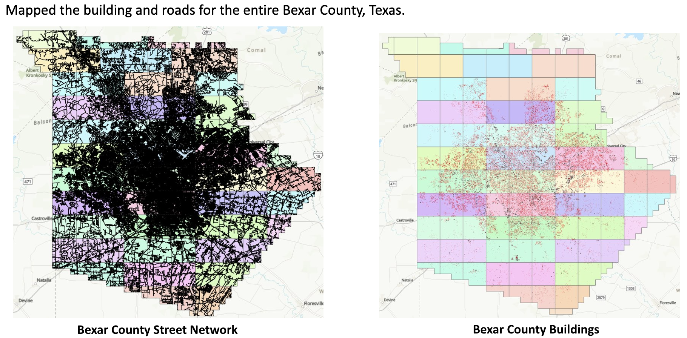
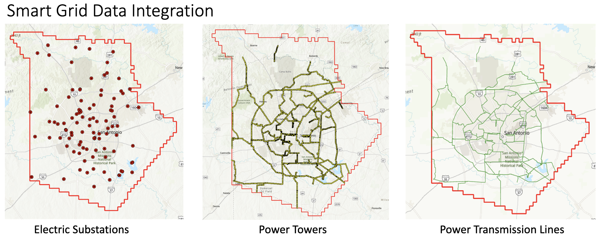
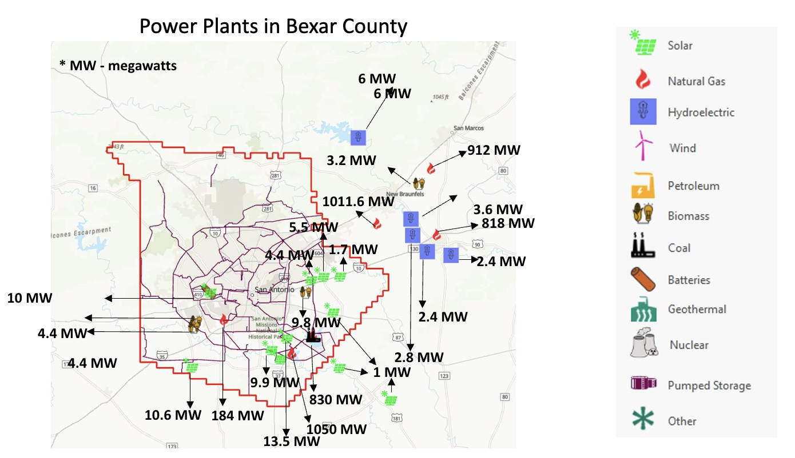
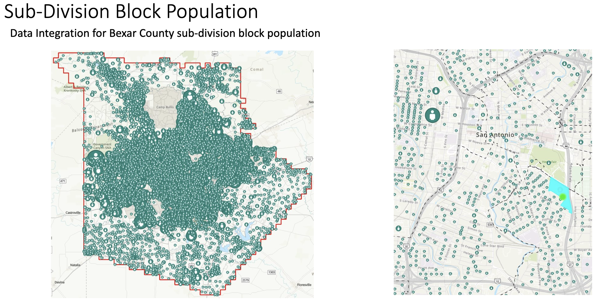
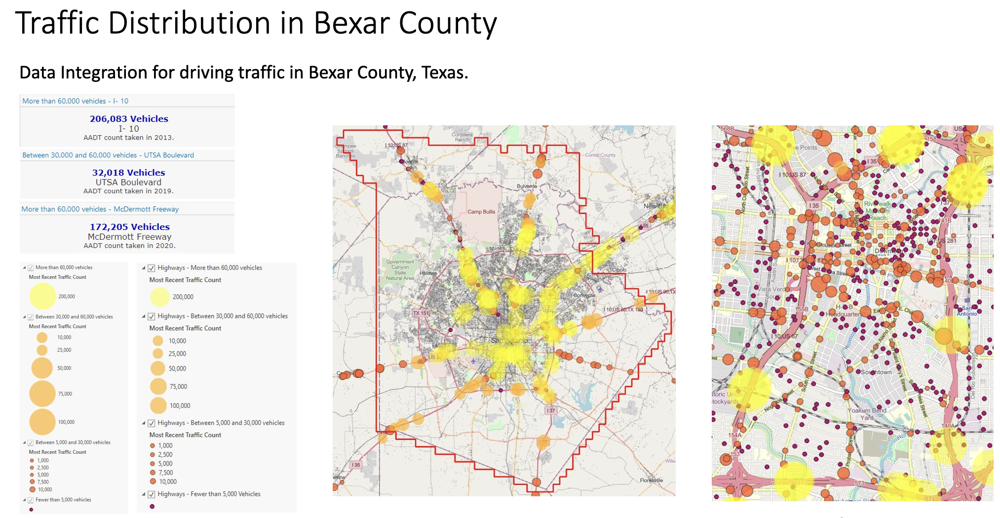
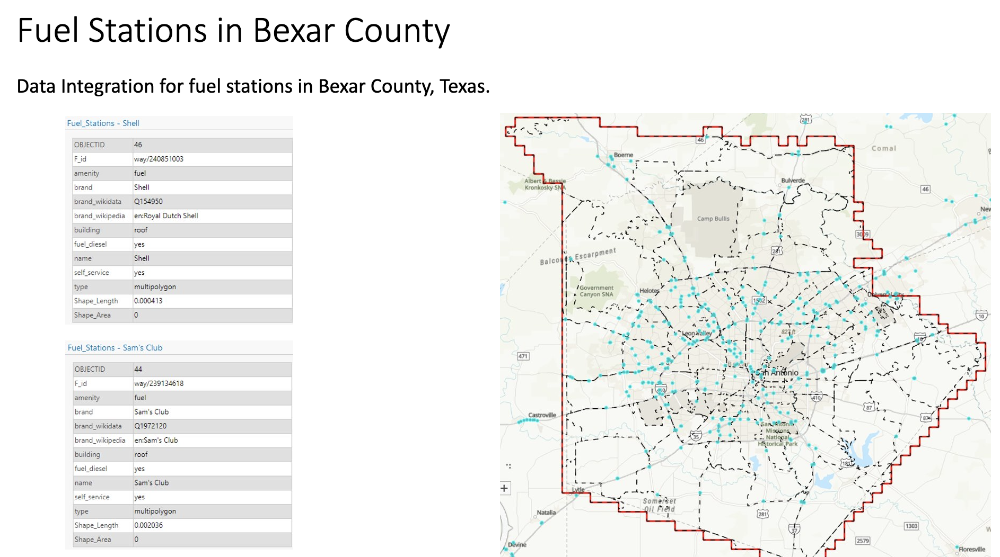
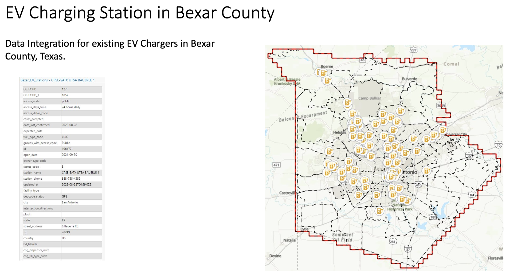
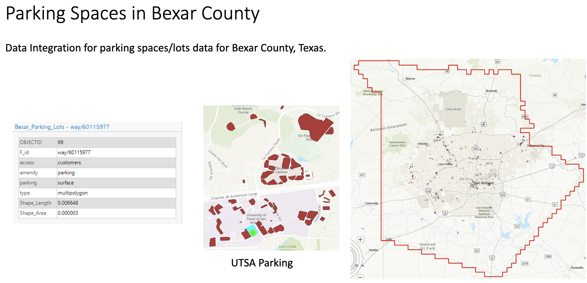

### Performed complex street network analysis using OpenStreetMaps and OSMNx

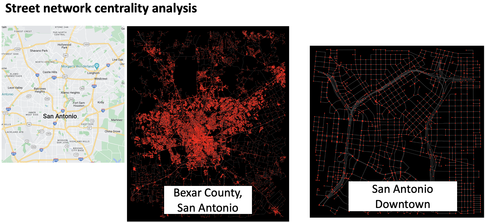
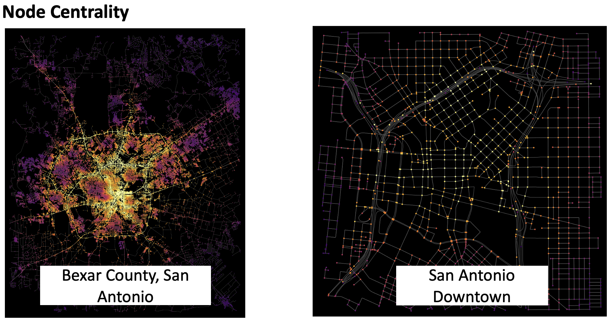
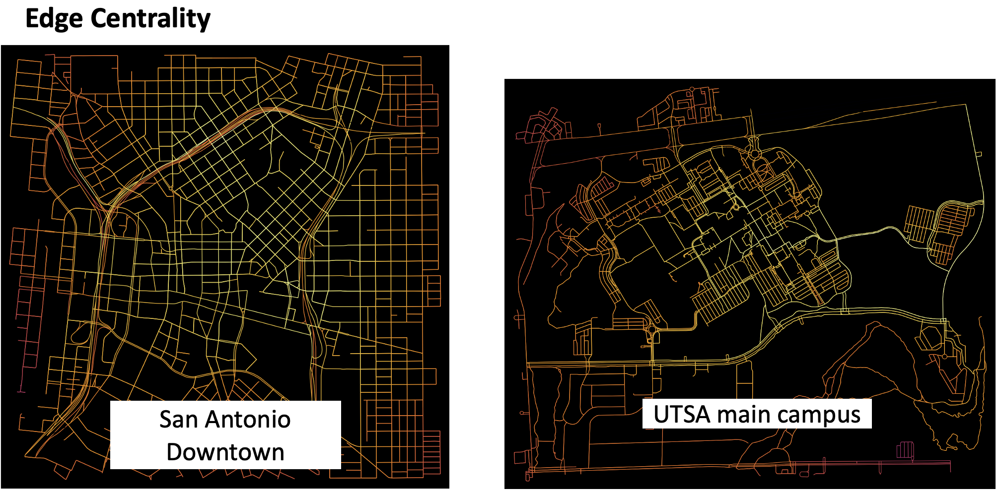
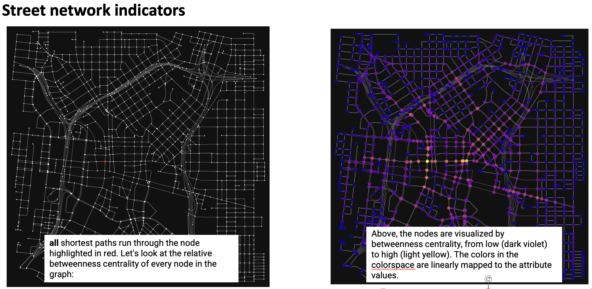

## Challenges
### Addressed and resolved overlapping issues of geo-referenced roads and buildings in CityEngine where the data consists of 200K+ 3D objects
### Initially, default get map data functionality was used in CityEngine to get the base map for 3D models generation where we had misalignment issues. Then, we used only the OpenStreetMap data to generate 3D models for streets and the results are pretty accurate, but we still have few misalignment of roads at the overlays (highway(s) on top of roads(s)).

## Data integration into NVIDIA OMNIVERSE
### To perform real-time 3D physics simulations and virtual inspection capabilities, the twin was simulated in NVIDIA Omniverse and integrated with VR & AR tech (Meta’s Oculus Quest 2, Microsoft’s Hololens) for visualization and teleporting of grid engineers. NVIDIA said this is the largest project in Universal Scene Description (USD) format within Omniverse till date.
### Also, autonomous systems testing was conducted on the digital twin virtually using Microsoft AirSim with Unity3D plugin.
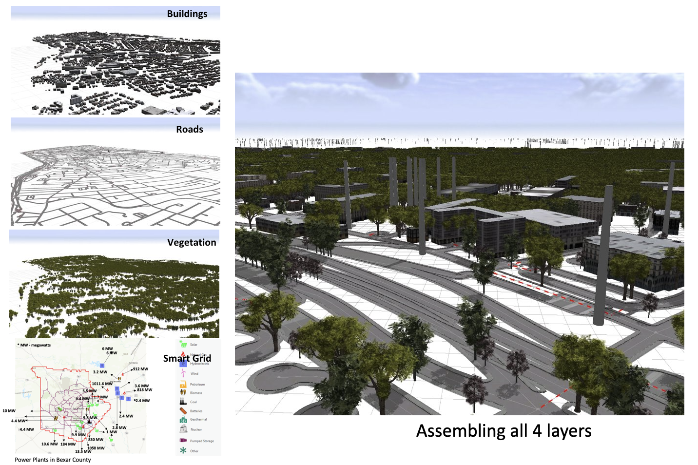

## Work in progress
### Developing an optimization model that aims to incentivize the time and location of electric vehicle charging stations, taking into account the data of existing EV charging stations, parking lots, population density, as well as businesses such as H-E-B, Walmart, UPS, Amazon, and many others in Bexar County, Texas, that operate fleet vehicles on a daily basis.
